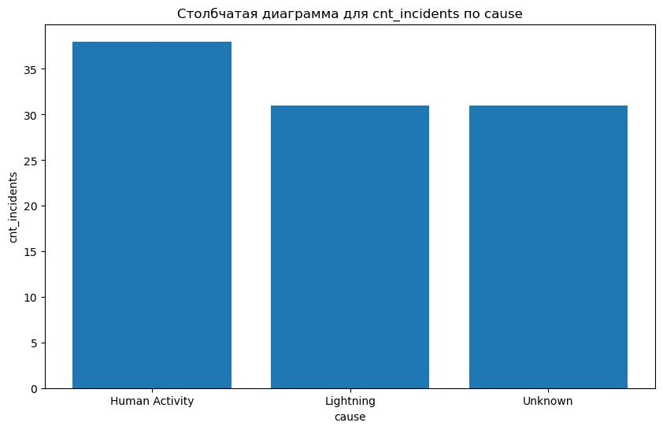
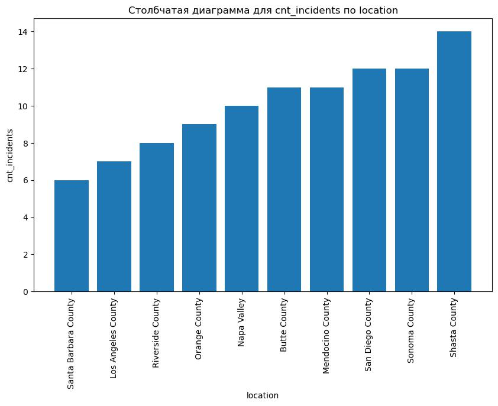
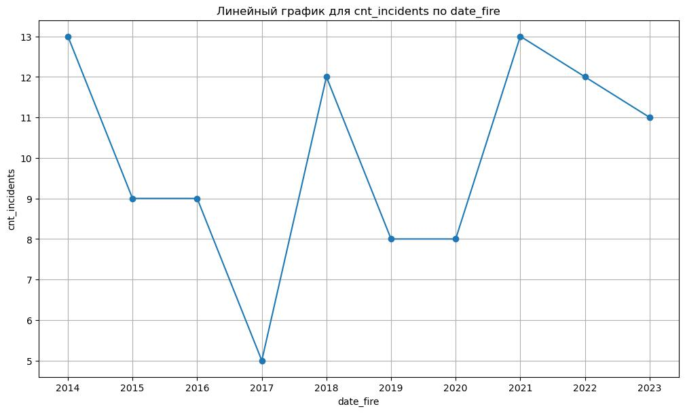
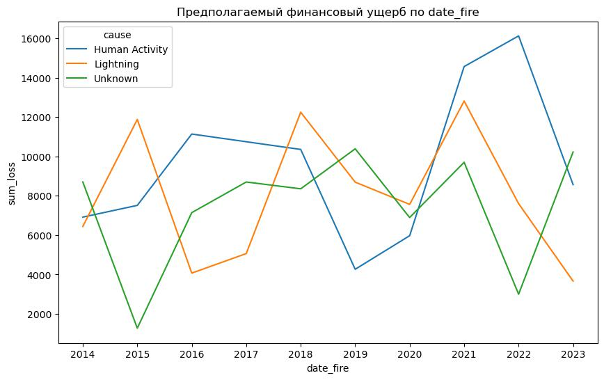

Домашнеее задание 3
=====================

# Условие:

1. Выберите любой открытый датасет и скачайте открытый датасет, соответствующий вашим интересам или области обучения.
2. Создайте новую базу данных в системе управления базами данных (например, SQLite, PostgreSQL).
3. Создайте таблицу (или несколько таблиц) в базе данных с различными типами данных (INTEGER, TEXT, DATE), которые требуются для вашего датасета. Импортируйте данные из датасета в созданные таблицы.
4. Напишите несколько SQL-запросов для извлечения данных из таблиц базы данных. Используйте условия фильтрации (например, WHERE) для получения нужных данных.
5. Напишите SQL-запросы, использующие агрегатные функции (SUM, AVG, COUNT) для выполнения расчетов по данным таблицы.
6. Визуализируйте данные. Используйте библиотеки Python, такие как Matplotlib или Seaborn, для визуализации данных, извлеченных из базы данных. Постройте графики или диаграммы, которые помогут проанализировать и понять данные.

# Датасет

Датасет взят по ссылке <https://www.kaggle.com/datasets/vivekattri/california-wildfire-damage-2014-feb2025>

# Модули

- data_analyze.py для анализа на пропуски и их заполнение
- data_loader.py для открытия файла CSV
- data_visual.py для визуализации графиков
- database.py для работы с БД
- log.py для логирования

# Полученные графики
1. 
2. 
3. 
4. 
