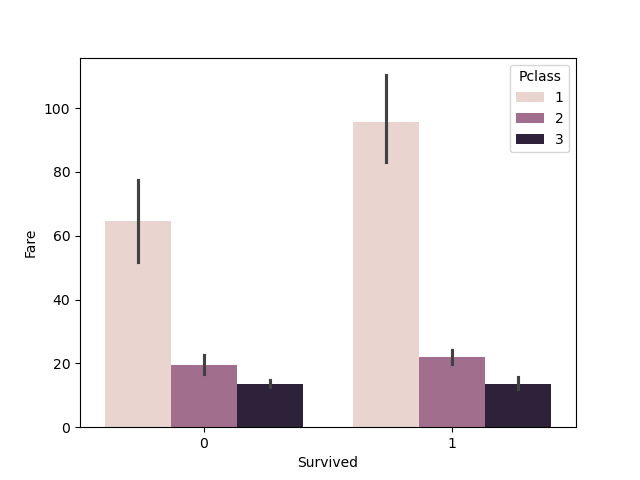
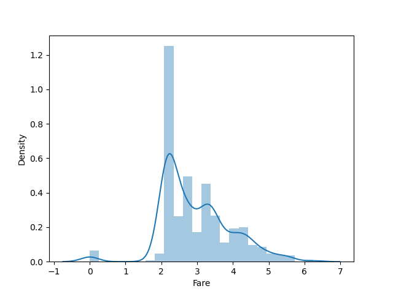

Домашнеее задание 4
=====================

# Условие:

Реализовать минимум 5 классификаторов, сравнить метрики между собой, выбрать лучший для Вашего датасета.

Классификаторы:
✓ Классификатор градиентного бустинга. 
✓ Классификатор CatBoost. 
✓ Классификатор Ada Boost. 
✓ Классификатор Extra Trees. 
✓ Квадратичный дискриминантный анализ. 	
✓ Light Gradient Boosting Machine. 
✓ Классификатор K Neighbors.  
✓ Классификатор дерева решений. 
✓ Экстремальный градиентный бустинг.
✓ Фиктивный классификатор.  
✓ SVM - линейное ядро.

8. Обучите модель на наборе данных Titanic и используйте различные стратегии перевзвешивания классов (например, oversampling, undersampling). Сравните результаты

# Датасет

Датасет взят по ссылке <https://www.kaggle.com/datasets/yasserh/titanic-dataset>

# Модули

- data_analyze.py для анализа на пропуски и их заполнение
- data_loader.py для открытия файла CSV
- data_visual.py для визуализации графиков
- log.py для логирования

# Полученные графики
1. 
2. 
3. 
4. 
5. 
6. 
7. 
8. 
9. 
10. 
11. 
12. 
13. 
14. 