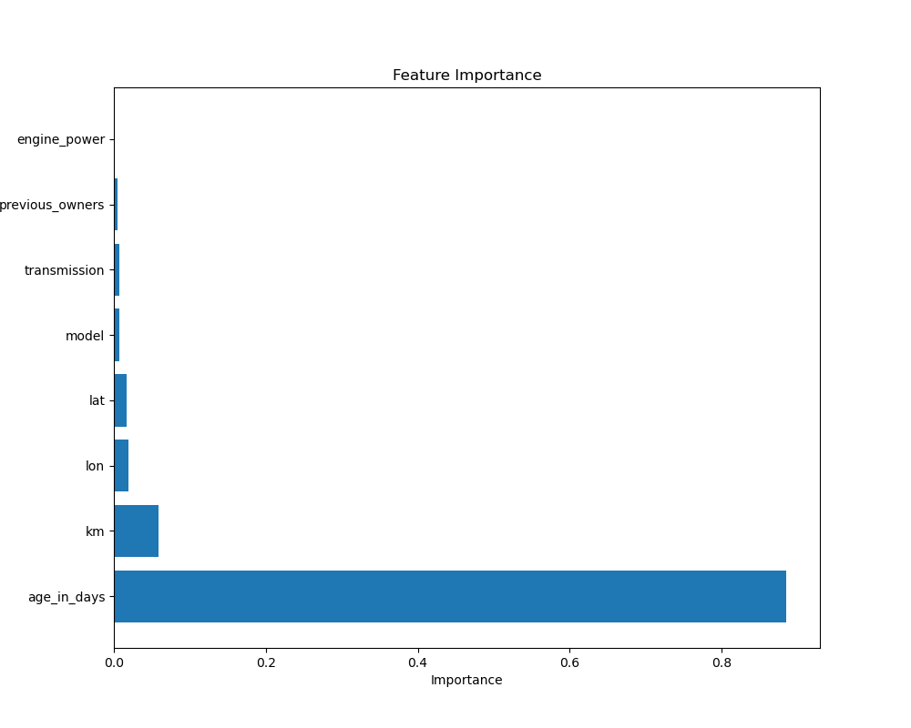
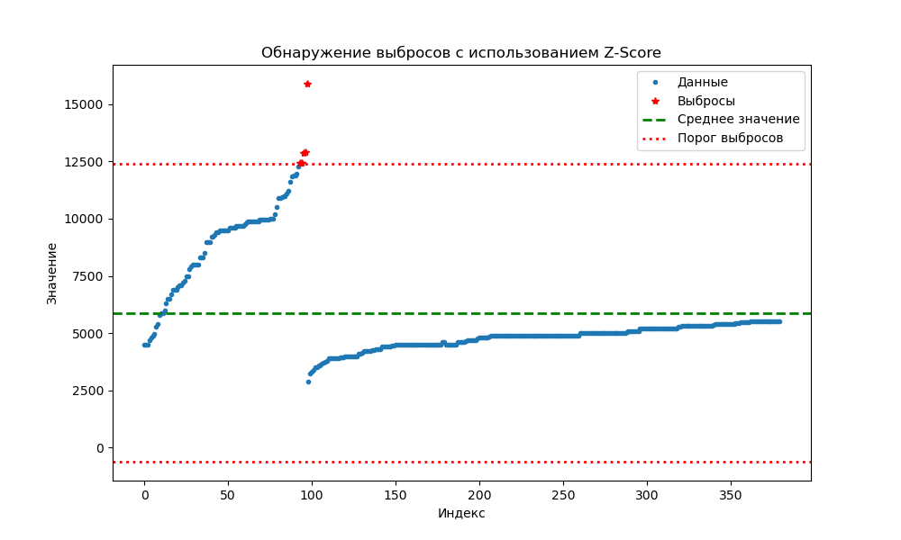
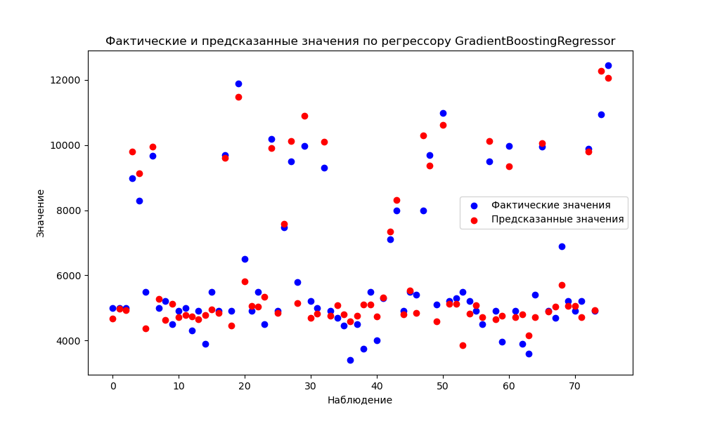
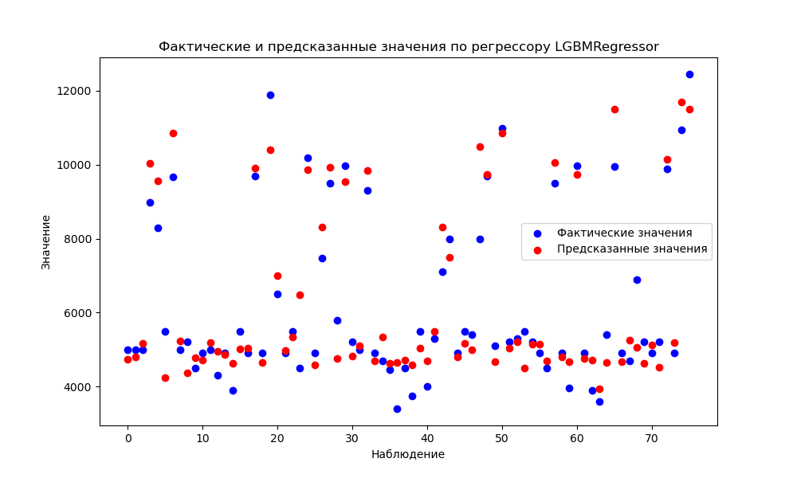
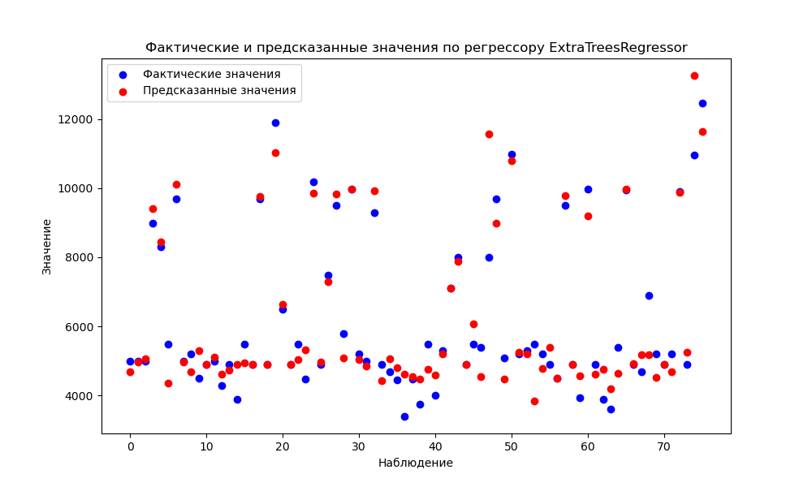
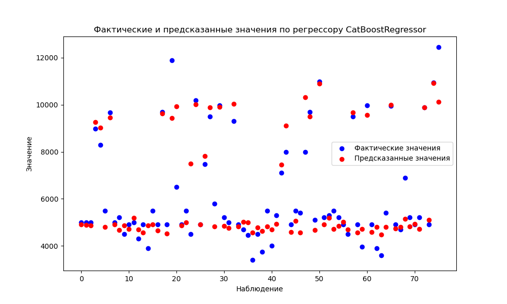
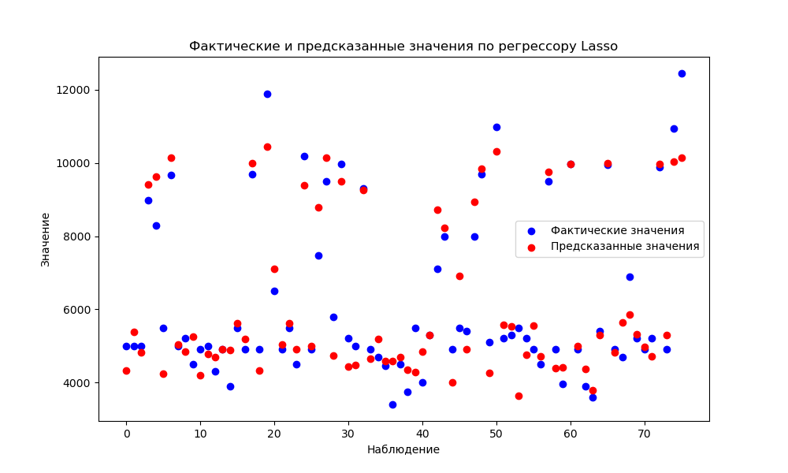

Домашнеее задание 5
=====================

# Условие:

РРеализовать минимум 5 регрессоров, сравнить метрики между собой, выбрать лучший для Вашего датасета. Можно использовать любой свой датасет.

Регрессоры:
- Регрессор Gradient Boosting.
- Регрессор LGBM.
- Экстремальный градиентный бустинг.
- Регрессор Extra Trees.
- Регрессор случайного леса. 
- Регрессор CatBoost.
- Регрессор AdaBoost.
- Регрессия Лассо.	
- Гребневая регрессия. 
- Байесовская регрессия.
- Линейная регрессия.
- Регрессор Губера.
- Регрессор дерева решений.
- Ортогональный поиск соответствия.
- Пассивно-агрессивный регрессор. 
- Регрессор K-ближайших соседей.
- Фиктивный регрессор.
- Elastic Net.
- Ансамбль регрессоров.

# Датасет

Датасет взят по ссылке <https://www.kaggle.com/datasets/paolocons/small-dataset-about-used-fiat-500-sold-in-italy>

# Модули

- data_analyze.py для анализа на пропуски и их заполнение
- data_loader.py для открытия файла CSV
- data_visual.py для визуализации графиков
- log.py для логирования

# Полученные графики
1. 
2. 
3. 
4. 
5. 
6. 
7. 
8. 

