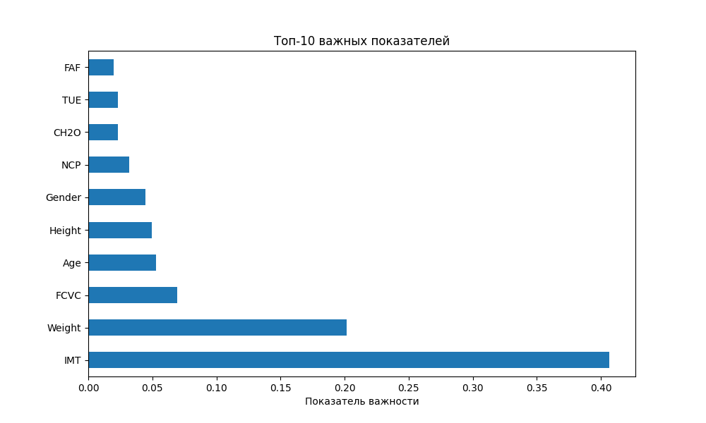
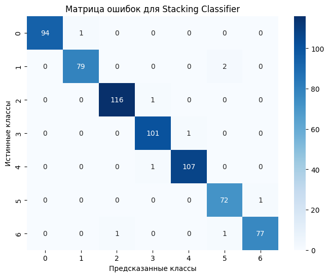

Финальная работа
=====================

# Условие:

- Взять набор данных исходя из ваших интересов.
- Не используйте датасеты, которые вы уже брали.
- Описать колонки, какие характеристики.
- Проведите анализ EDA.
- Провести предварительную обработку данных, если это необходимо (сделать данные понятными для модели машинного обучения: заполнить пропущенные значения, заменить категориальные признаки и т.д.)
- Решить задачу сегментации или анализа временного ряда при помощи не менее 5-ти подходов ML. Составьте ансамбль моделей.
- Решить задачу поиска аномалий.
- Визуализация. Создать графики ошибок прогнозирования, метрик качества обученной модели и важности признаков.
- Результат выполнения финальной работы разместить в гит репозиторий.

# Датасет

Датасет взят по ссылке <https://www.kaggle.com/datasets/ruchikakumbhar/obesity-prediction?resource=download>

# Модули

- data_analyze.py для анализа на пропуски и их заполнение
- data_loader.py для открытия файла CSV
- data_visual.py для визуализации графиков
- log.py для логирования

# Полученные графики

Все графики находятся в папке out_jpg.
- feature - Графики распределения показателей датасета
- clustering - Результат кластеризации (внутри папки с графиками по методам)

1. 
2. 
3. 
4. 

